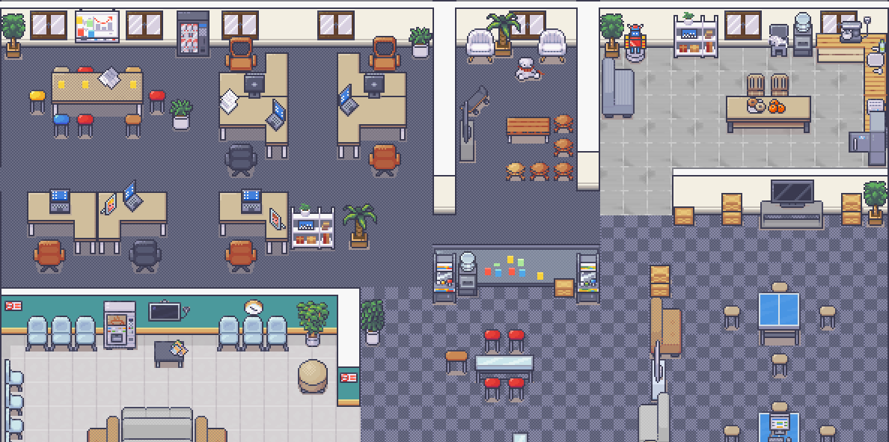

NOTE: THIS IS THE WORKING EDITION OF WORKADVENTURE

Run:

```
1. Clone the repository
2. pip install docker docker-compose
3. cd to the repository
4. docker-compose up --build
5. after all containers have built to localhost ports, gracefully ctrl+c
5. cp .env.template .env
6. docker-compose up -d
7. access play.workadventure.localhost
```

 [](https://discord.gg/G6Xh9ZM9aR)




Live demo [here](https://play.staging.workadventu.re/@/tcm/workadventure/wa-village).

# WorkAdventure

WorkAdventure is a web-based collaborative workspace presented in the form of a
16-bit video game.

In WorkAdventure you can move around your office and talk to your colleagues (using a video-chat system, triggered when you approach someone).

See more features for your virtual office: https://workadventu.re/virtual-office

## Community resources

Check out resources developed by the WorkAdventure community at [awesome-workadventure](https://github.com/workadventure/awesome-workadventure)

## Setting up a production environment

We support 2 ways to set up a production environment:

- using Docker Compose
- or using a Helm chart for Kubernetes

Please check the [Setting up a production environment](docs/others/self-hosting/install.md) guide for more information.

> [!NOTE]
> WorkAdventure also provides a [hosted version](https://workadventu.re) of the application. Using the hosted version is 
> the easiest way to get started and helps us to keep the project alive.

## Setting up a development environment

> [!NOTE]
> These installation instructions are for local development only. They will not work on
> remote servers as local environments do not have HTTPS certificates.

Install Docker and clone this repository.

> [!WARNING]
> If you are using Windows, make sure the End-Of-Line character is not modified by the cloning process by setting
> the `core.autocrlf` setting to false: `git config --global core.autocrlf false`


You can view the Traefik dashboard at http://traefik.workadventure.localhost

Note: on some OSes, you will need to add this line to your `/etc/hosts` file:

**/etc/hosts**
```
127.0.0.1 oidc.workadventure.localhost redis.workadventure.localhost play.workadventure.localhost chat.workadventure.localhost traefik.workadventure.localhost xmpp.workadventure.localhost extra.workadventure.localhost icon.workadventure.localhost map-storage.workadventure.localhost uploader.workadventure.localhost maps.workadventure.localhost api.workadventure.localhost front.workadventure.localhost
```

You can also start WorkAdventure + a test OpenID connect server using:

```console
$ docker-compose -f docker-compose.yaml -f docker-compose-oidc.yaml up
```

(Test user is "User1" and his password is "pwd")


### Troubleshooting

See our [troubleshooting guide](docs/dev/troubleshooting.md).
